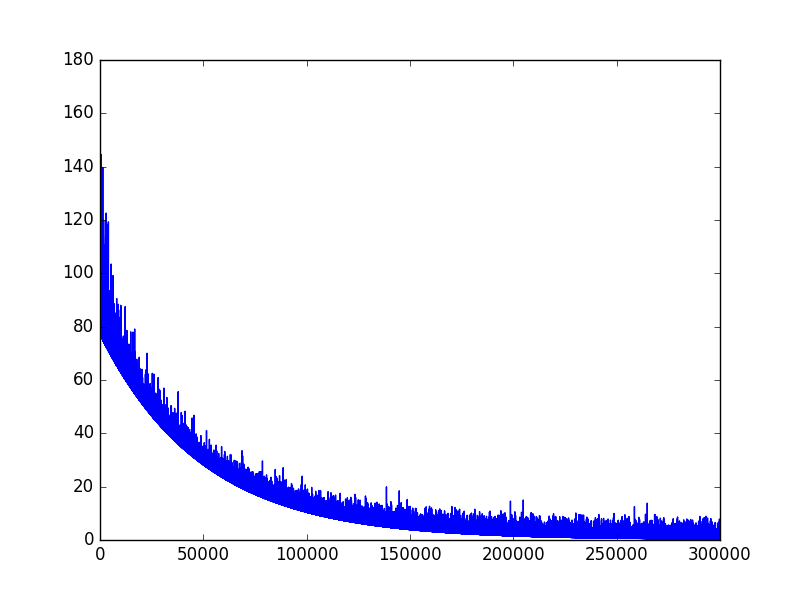
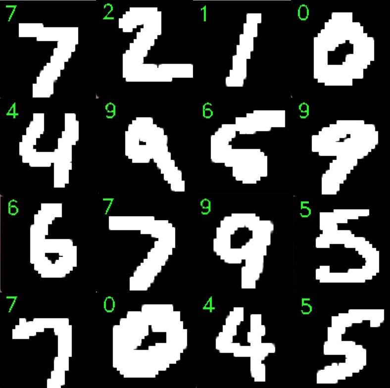

# Handwritten Digit Recognition Using Neural Network


This repo builds a 3-layer neural network from scratch to recognize the MNIST Database of handwritten digits, only based on a python library ```numpy```.

## Getting Started
The example implements these concept:
* Weight Initialization
* Layer
  * ReLu
  * Softmax
* Training
  * Backpropagation
  * Gradient Descent
* Loss
  * Cross-entropy Loss
  * Regularation Loss
  
## Running the Codes
  
```python main.py```

In the ```main.py```, you can modify the learning rate, epoch and batch size.

```python test.py```

Use ```test.py``` to show the test images by ```opencv``` and print the predicted result.

## Results

* batch size: 1
* learning rate: 0.001
* epoch: 5
* final loss: 0.6



* accuracy: 0.92



## Blog Post
https://medium.com/deep-learning-g/handwritten-digit-recognition-using-neural-network-67d7ec76a013
